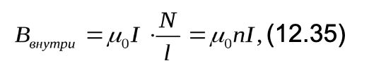
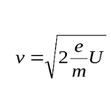
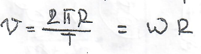

e_charge = 1.60217662e-19 - заряд злектрона  -1,602176634 * 10^19 [Кл]

В данном случае берем абсолютное значение для более простых вичислений и наглядных графиков

m_electron = 9.10938356e-31  - масса электрона [Кг]

mu_0 = 4 * np.pi * 1e-7  - магнитная проницаемость вакуума [Гн/м]

---

````
def electron_motion(y, t, U, B, m, e):
    x, y, vx, vy = y
    dvxdt = (e / m) * vy * B
    dvydt = -(e / m) * vx * B - (e / m) * U * vy / np.sqrt(vx ** 2 + vy ** 2)
    return [vx, vy, dvxdt, dvydt]
````

1) sol = odeint(electron_motion, [x0, y0, v0, 0], t, args=(U, B, m_electron, e_charge))

       x, y, vx, vy = y y - [x0, y0, v0, 0]


2) dvxdt = (e / m) * vy * B  - это уравнение Лоренца, которое описывает силу, действующую на заряженную частицу, движущуюся в магнитном поле. 
    
       F_лоренца = q * v * B * sin(a), q - заряд, v - скорость, B вектор магнитной индукции, а - улог между v и B. У нас sin(a) = 1.
    
       По 2 З.Н. ∑F = ma, F = ma, F = q v B sin(a) => ma = q v B sin(a) => a = q/m v B sin(a), который у нас 1, тк V | B.  


3) dvydt = -(e / m) * vx * B - (e / m) * U * vy / np.sqrt(vx ** 2 + vy ** 2) 

       Минусы тут - направление, по поводу остального: (e / m) * vx * B - ну это уже понятно из п.2. 

       А (e / m) * U * vy / np.sqrt(vx ** 2 + vy ** 2) как я пон идет из E = F/q и qEd = qU.

       F = ma (II З.Н),
       F = Eq, F = ma => ma = Eq => a = (q/m)E ==(E = U/d)> a = (q/m)U/d, 

       как я пон по Пифагору нашли расстояние d => (np.sqrt(vx ** 2 + vy ** 2)) => (e / m) * U / np.sqrt(vx ** 2 + vy ** 2). vy тут скорее всего, чтобы учесть скорость (выводя это руками я не смог найти что-то с v).

---

````
def orbit_radius(I, U, n):
    B = mu_0 * n * I

    if B == 0:
        return

    return math.sqrt((m_electron * 2 * U)/(e_charge * (B ** 2)))
````

1) B = mu_0 * n * I 
    
       B - магнитное поле внутри соленоида,
    
       mu_0 - магнитная проницаемость вакуума,

       n - число витков на единицу длины соленоида,
   
       I - ток через соленоид.

    Это уже готовая формула 

    <p align="center">
    
    </p>

    [формула со studfile](https://studfile.net/preview/2953066/page:5/)

2) math.sqrt((m_electron * 2 * U)/(e_charge * (B ** 2)))
     
   уф, ну поехали

          F_центробежная = m w^2 r, где
          m - масса,
          w (омега) - угловая скорость,
          r - радиус.

   F_лоренца (была выше) = qvBsin(a) 
   
   ### вывод

           F_ц = F_л
        
           Когда заряженная частица движется в магнитном поле, на нее действует сила Лоренца.
           Если частица движется перпендикулярно магнитному полю, эта сила вызывает центробежное движение, и частица начинает двигаться по круговой орбите.

           mw^2r = qvBsin(a)                           (sin(a) = 1, v = wr => w = v/r)

           m (v/r)^2 r = qvB                           ((v/r)^2 * r/v = v/r)

           m v/r = qB                                  (умножаем на r делим на qB)

           mv/qB = r                                   (v = sqrt( 2 * e/m * U), q = e)

           m * sqrt(2 *  e/m * U) / e B = r            (m = sqrt(m^2) и тд)

           sqrt(m^2 * 2 * e/m * U / (e^2 * B^2)) = r   (сокращаем m и e)

           sqrt(m * 2 * U / (e * B^2)) = r

   ##### букОвы:
          
           F_ц - центробежная сила [Н],
           m - масса [Кг],
           w (омега) - угловая скорость [рад/с],
           r - радиус [м],
           F_л - сила Лоренца [H],
           B - вектор магнитной индукции [Тл],
           q - заряд [Кл],
           v - скорость [м/с],
           e - заряд электрона [Кл],
           U - напрядение [В].

   ##### формула для v

    <p align="center">
    
    </p>

   [формула со studfile](https://studfile.net/preview/1644348/)
---

````
def simulate_and_plot(U, Ic, Rk, steps=1000, tmax=1e-6, stop_velocity=None):
    n = 100  # Число витков на единицу длины
    B = mu_0 * n * Ic  # Магнитное поле внутри соленоида

    # Начальные условия
    x0 = Rk
    y0 = 0
    v0 = np.sqrt(2 * e_charge * U / m_electron)
    r_orbit = orbit_radius(Ic, U, n)  # Вычисление радиуса орбиты

    # Угловая скорость электрона
    omega = v0 / r_orbit

    # Временной массив
    t = np.linspace(0, tmax, steps)

    # Решение дифференциальных уравнений
    sol = odeint(electron_motion, [x0, y0, v0, 0], t, args=(U, B, m_electron, e_charge))

    # Остановка моделирования по заданной скорости
    if stop_velocity is not None:
        idx = np.where(np.sqrt(sol[:, 2] ** 2 + sol[:, 3] ** 2) <= stop_velocity)[0]
        if len(idx) > 0:
            sol = sol[:idx[0] + 1]

    # Построение траектории
    plt.figure(figsize=(8, 6))
    plt.plot(sol[:, 0], sol[:, 1])
    plt.xlabel('x')
    plt.ylabel('y')
    plt.title('Траектория электрона')
    plt.gca().set_aspect('equal', adjustable='box')
    plt.grid(True)
    plt.show()

    return r_orbit
````

1) n = 100  - Число витков на единицу длины, B = mu_0 * n * Ic  - Магнитное поле внутри соленоида (было разобрано в прошлом пункте)

2)  x0 = Rk, y0 = 0, v0 = np.sqrt(2 * e_charge * U / m_electron), r_orbit = orbit_radius(Ic, U, n)
   
   x0 = Rk    (Rk - радиус катода)

         Это начальное положение электрона по оси x.
         Электрон начинает свое движение из катода, поэтому его начальное положение по оси x равно радиусу катода

   y0 = 0
         
         Это начальное положение электрона по оси y.
         Поскольку мы рассматриваем движение электрона в плоскости x-y, мы можем считать, что электрон начинает свое движение из точки (Rk, 0)

   v0 = np.sqrt(2 * e_charge * U / m_electron)

         Это начальная скорость электрона.
   <p align="center">
    
    </p>

   [формула со studfile](https://studfile.net/preview/1644348/)

   r_orbit = orbit_radius(Ic, U, n)

         Вычисление радиуса орбиты через функцию из прошлого раздела.
         Тут Ic - ток в соленоиде [A], U - разность потенциалов/напряжение [B], n - число витков на единицу длины.

3) omega = v0 / r_orbit

   вот формула: 

   <p align="center">
    
    </p>

   Просто делим это на R

4) t = np.linspace(0, tmax, steps), sol = odeint(electron_motion, [x0, y0, v0, 0], t, args=(U, B, m_electron, e_charge))

   t = np.linspace(0, tmax, steps)

         Это создание временного массива.
         Функция np.linspace из библиотеки numpy генерирует равномерно распределенные значения в заданном интервале.
         В данном случае, она создает массив временных моментов от 0 до tmax включительно, состоящий из steps элементов.
         Этот массив времени используется для моделирования движения электрона в течение заданного времени tmax.

   sol = odeint(electron_motion, [x0, y0, v0, 0], t, args=(U, B, m_electron, e_charge))

         Это решение системы дифференциальных уравнений, описывающих движение электрона.
         Функция odeint из библиотеки scipy.integrate используется для численного решения системы обыкновенных дифференциальных уравнений (ODE).
         В данном случае, она решает систему ODE, заданную функцией electron_motion, с начальными условиями [x0, y0, v0, 0] и временным массивом t.
         Дополнительные аргументы для функции electron_motion передаются через параметр args.
         Результатом работы функции odeint является массив sol, каждая строка которого содержит значения x, y, vx, vy в соответствующий момент времени.

5) Остановка моделирования по заданной скорости 

   ````
       if stop_velocity is not None:
        idx = np.where(np.sqrt(sol[:, 2] ** 2 + sol[:, 3] ** 2) <= stop_velocity)[0]
   
        if len(idx) > 0:
            sol = sol[:idx[0] + 1]
   ````
   
        if stop_velocity is not None:

        Это условное выражение проверяет, задано ли значение для stop_velocity.
        Если stop_velocity не равно None, то код внутри этого условного блока будет выполнен.

        idx = np.where(np.sqrt(sol[:, 2] ** 2 + sol[:, 3] ** 2) <= stop_velocity)[0]:
        Это выражение использует функцию np.where из библиотеки numpy для нахождения индексов элементов в массиве, которые удовлетворяют заданному условию. 
        
        Где sol[:, 2] и sol[:, 3] - это скорости электрона по оси x и y соответственно в каждый момент времени.
        Таким образом, idx - это индекс первого момента времени, когда скорость электрона становится меньше или равной stop_velocity. 

        if len(idx) > 0:: Это еще одно условное выражение, которое проверяет, найден ли хотя бы один момент времени, когда скорость электрона становится меньше или равной stop_velocity.

        sol = sol[:idx[0] + 1]: Если такой момент времени найден, то массив sol обрезается до этого момента времени (включительно).
        Таким образом, все последующие значения sol, соответствующие моментам времени, когда скорость электрона меньше stop_velocity, игнорируются.

        В общем, этот фрагмент кода позволяет остановить моделирование движения электрона, когда его скорость достигает заданного значения stop_velocity.
        Тут это сделано для экономии вычислительных ресурсов, если скорость электрона становится слишком малой и его дальнейшее движение не представляет интереса.

6) Построение графиков (на всякий)

   ````
   plt.figure(figsize=(8, 6))
    plt.plot(sol[:, 0], sol[:, 1])
    plt.xlabel('x')
    plt.ylabel('y')
    plt.title('Траектория электрона')
    plt.gca().set_aspect('equal', adjustable='box')
    plt.grid(True)
    plt.show()

    return r_orbit
   ````
   
       plt.figure(figsize=(8, 6)): Это создание новой фигуры для графика с заданным размером.
       Функция plt.figure из библиотеки matplotlib.pyplot используется для создания новой фигуры для графика.
       Параметр figsize задает размер фигуры в дюймах.

       plt.plot(sol[:, 0], sol[:, 1]): Это построение графика траектории движения электрона.
       Функция plt.plot используется для построения графика. sol[:, 0] и sol[:, 1] - это координаты x и y электрона в каждый момент времени.

       plt.xlabel('x') и plt.ylabel('y'): Это установка подписей осей графика.
       Функции plt.xlabel и plt.ylabel используются для установки подписей осей x и y соответственно.

       plt.title('Траектория электрона'): Это установка заголовка графика.
       Функция plt.title используется для установки заголовка графика.

       plt.gca().set_aspect('equal', adjustable='box'): Это установка равного масштаба осей x и y, чтобы окружности выглядели как окружности, а не как эллипсы.
       Функция plt.gca().set_aspect используется для установки аспекта текущих осей.

       plt.grid(True): Это добавление сетки на график.
       Функция plt.grid используется для добавления сетки на график.

       plt.show(): Это отображение графика.
       Функция plt.show используется для отображения графика.
       Все предыдущие команды только подготавливают график, и он фактически отображается только после вызова этой функции.

       return r_orbit: Это возвращение радиуса орбиты электрона из функции. Значение r_orbit, вычисленное в функции, возвращается как результат работы функции.
---

````
def find_required_current(Ra, Rk, n, U):
    r_orbit = (Ra - Rk) / 2  # Радиус окружности

    if (r_orbit * e_charge * n * mu_0) == 0:
        return

    Ic_required = (m_electron * math.sqrt(2 * (e_charge / m_electron) * U)) / (r_orbit * e_charge * n * mu_0)

    return Ic_required
````

1) r_orbit = (Ra - Rk) / 2

       r_orbit = (Ra - Rk) / 2    (r_orbit - радиус орбиты электрона [м], Ra - радиус анода [м], Rk - радиус катода [м])

       Здесь вычисляется радиус орбиты электрона.
       Это половина разницы между радиусами анода и катода, так как электрон должен описывать окружность диаметром (Ra-Rk).

2) (r_orbit * e_charge * n * mu_0) == 0

       Это проверка на ноль в знаменателе следующей формулы.
       Если это выражение равно нулю, функция возвращает None, чтобы избежать деления на ноль.

3) Ic_required = (m_electron * math.sqrt(2 * (e_charge / m_electron) * U)) / (r_orbit * e_charge * n * mu_0)

       F_центробежная = mw^2r
       F_лоренца = qvB
       qvB = mw^2r            (w^2 = v^2/r^2)
       qvB = m v^2/r^2 r      (сокращаем r и v)
       qB = m v/r
       v = rqB/m    =>        (B = mv/rq) (B = mu_0 n I)
       n mu_o I = mv/rq
       I = m v / (r q n mu_o) (q = e, v = sqrt(2 e/m U))
       I = m sqrt(2 e/m U) / (r q n mu_o)
       
       новых буков нет 🤓.
---

````
def plot_Ic_U_diagram_with_circle(Ra, Rk, n):
    U_values = np.linspace(0, 1000, 100)  # Диапазон разности потенциалов

    # Создание списка для значений силы тока в соленоиде
    Ic_values = []

    for U in U_values:
        # Вычисление соответствующей силы тока Ic, чтобы электрон описывал окружность диаметром (Ra-Rk)
        Ic_required = find_required_current(Ra, Rk, n, U)
        Ic_values.append(Ic_required)

    # Приведение значений к числовому типу
    Ic_values = np.array(Ic_values, dtype=np.float64)

    plt.figure(figsize=(8, 6))
    plt.plot(U_values, Ic_values, label='Ic', color='blue')

    plt.fill_between(U_values, Ic_values, color='red', alpha=0.3, label='Электрон описывает окружность (Ra-Rk)')

    plt.xlabel('Разность потенциалов (U)')
    plt.ylabel('Сила тока в соленоиде (Ic)')
    plt.title('Диаграмма Ic от U')
    plt.grid(True)
    plt.legend()
    plt.show()


# Пример использования
Ra = 0.01  # Радиус анода в метрах
Rk = 0.005  # Радиус катода в метрах
U = 100  # Разность потенциалов в вольтах
Ic = 1  # Начальное значение тока в соленоиде
n = 100  # Число витков на единицу длины

# Моделирование и построение траектории
r_orbit = simulate_and_plot(U, Ic, Rk, stop_velocity=1e5)
print("Радиус орбиты электрона:", r_orbit)

# Построение диаграммы Ic от U
plot_Ic_U_diagram_with_circle(Ra, Rk, n)
````

    Функция plot_Ic_U_diagram_with_circle(Ra, Rk, n) строит диаграмму зависимости силы тока в соленоиде Ic от разности потенциалов U, а также отмечает область, где электрон описывает окружность диаметром (Ra-Rk). Вот подробное объяснение каждого шага:

    U_values = np.linspace(0, 1000, 100):
    Создается массив U_values, который представляет собой равномерно распределенные значения разности потенциалов от 0 до 1000. Это делается для построения графика.

    Ic_values = []:
    Инициализируется пустой список Ic_values для хранения значений силы тока в соленоиде.

    В цикле for U in U_values для каждого значения U из U_values вычисляется соответствующая сила тока Ic, необходимая для того, чтобы электрон описывал окружность диаметром (Ra-Rk).
    Это делается с помощью функции find_required_current(Ra, Rk, n, U), которая возвращает необходимую силу тока Ic.
    Значение Ic затем добавляется в список Ic_values.

    Ic_values = np.array(Ic_values, dtype=np.float64):
    Список Ic_values преобразуется в массив NumPy для дальнейшего использования.

    Далее создается новый график с размером (8, 6).
    На графике строится кривая, отображающая зависимость Ic от U (синяя линия).

    Затем используется функция plt.fill_between(U_values, Ic_values, color='red', alpha=0.3, label='Электрон описывает окружность (Ra-Rk)') для заполнения области под кривой синей линии красным цветом. Эта область представляет собой область значений, при которых электрон описывает окружность диаметром (Ra-Rk).

    После этого добавляются подписи к осям и заголовок графика, включается сетка и отображается легенда.

    В конце вызывается plt.show() для отображения графика.

    В примере использования задаются значения Ra, Rk, U, Ic и n, затем вызывается функция simulate_and_plot(U, Ic, Rk, stop_velocity=1e5) для моделирования и построения траектории электрона, а затем функция plot_Ic_U_diagram_with_circle(Ra, Rk, n) для построения диаграммы Ic от U.

````
# Пример использования
Ra = 0.01  # Радиус анода в метрах
Rk = 0.005  # Радиус катода в метрах
U = 100  # Разность потенциалов в вольтах
Ic = 1  # Начальное значение тока в соленоиде
n = 100  # Число витков на единицу длины

# Моделирование и построение траектории
r_orbit = simulate_and_plot(U, Ic, Rk, stop_velocity=1e5)
print("Радиус орбиты электрона:", r_orbit)

# Построение диаграммы Ic от U
plot_Ic_U_diagram_with_circle(Ra, Rk, n)
````

    Константы и вывод результатов
---

все вышенаписанное относится к этому коду

````
import math

import numpy as np
import matplotlib.pyplot as plt
from scipy.integrate import odeint

# Константы
e_charge = 1.60217662e-19  # элементарный заряд
m_electron = 9.10938356e-31  # масса электрона
mu_0 = 4 * np.pi * 1e-7  # магнитная проницаемость вакуума


# Функция для дифференциальных уравнений, описывающих движение электрона
def electron_motion(y, t, U, B, m, e):
    x, y, vx, vy = y
    dvxdt = (e / m) * vy * B
    dvydt = -(e / m) * vx * B - (e / m) * U * vy / np.sqrt(vx ** 2 + vy ** 2)

    return [vx, vy, dvxdt, dvydt]


# Функция для вычисления радиуса орбиты электрона
def orbit_radius(I, U, n):
    B = mu_0 * n * I

    if B == 0:
        return

    return math.sqrt((m_electron * 2 * U)/(e_charge * (B ** 2)))


def simulate_and_plot(U, Ic, Rk, steps=1000, tmax=1e-6, stop_velocity=None):
    n = 100  # Число витков на единицу длины
    B = mu_0 * n * Ic  # Магнитное поле внутри соленоида

    # Начальные условия
    x0 = Rk
    y0 = 0
    v0 = np.sqrt(2 * e_charge * U / m_electron)
    r_orbit = orbit_radius(Ic, U, n)  # Вычисление радиуса орбиты

    # Угловая скорость электрона
    omega = v0 / r_orbit

    # Временной массив
    t = np.linspace(0, tmax, steps)

    # Решение дифференциальных уравнений
    sol = odeint(electron_motion, [x0, y0, v0, 0], t, args=(U, B, m_electron, e_charge))

    # Остановка моделирования по заданной скорости
    if stop_velocity is not None:
        idx = np.where(np.sqrt(sol[:, 2] ** 2 + sol[:, 3] ** 2) <= stop_velocity)[0]
        if len(idx) > 0:
            sol = sol[:idx[0] + 1]

    # Построение траектории
    plt.figure(figsize=(8, 6))
    plt.plot(sol[:, 0], sol[:, 1])
    plt.xlabel('x')
    plt.ylabel('y')
    plt.title('Траектория электрона')
    plt.gca().set_aspect('equal', adjustable='box')
    plt.grid(True)
    plt.show()

    return r_orbit


def find_required_current(Ra, Rk, n, U):
    r_orbit = (Ra - Rk) / 2  # Радиус окружности

    if (r_orbit * e_charge * n * mu_0) == 0:
        return

    Ic_required = (m_electron * math.sqrt(2 * (e_charge / m_electron) * U)) / (r_orbit * e_charge * n * mu_0)

    return Ic_required


# Функция для построения диаграммы (Ic от U) и отметки области, где электрон описывает окружность диаметром (Ra-Rk)
def plot_Ic_U_diagram_with_circle(Ra, Rk, n):
    U_values = np.linspace(0, 1000, 100)  # Диапазон разности потенциалов

    # Создание списка для значений силы тока в соленоиде
    Ic_values = []

    for U in U_values:
        # Вычисление соответствующей силы тока Ic, чтобы электрон описывал окружность диаметром (Ra-Rk)
        Ic_required = find_required_current(Ra, Rk, n, U)
        Ic_values.append(Ic_required)

    # Приведение значений к числовому типу
    Ic_values = np.array(Ic_values, dtype=np.float64)

    plt.figure(figsize=(8, 6))
    plt.plot(U_values, Ic_values, label='Ic', color='blue')

    plt.fill_between(U_values, Ic_values, color='red', alpha=0.3, label='Электрон описывает окружность (Ra-Rk)')

    plt.xlabel('Разность потенциалов (U)')
    plt.ylabel('Сила тока в соленоиде (Ic)')
    plt.title('Диаграмма Ic от U')
    plt.grid(True)
    plt.legend()
    plt.show()


# Пример использования
Ra = 0.01  # Радиус анода в метрах
Rk = 0.005  # Радиус катода в метрах
U = 100  # Разность потенциалов в вольтах
Ic = 1  # Начальное значение тока в соленоиде
n = 100  # Число витков на единицу длины

# Моделирование и построение траектории
r_orbit = simulate_and_plot(U, Ic, Rk, stop_velocity=1e5)
print("Радиус орбиты электрона:", r_orbit)

# Построение диаграммы Ic от U
plot_Ic_U_diagram_with_circle(Ra, Rk, n)
````

---