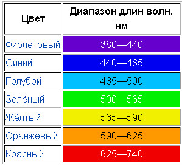
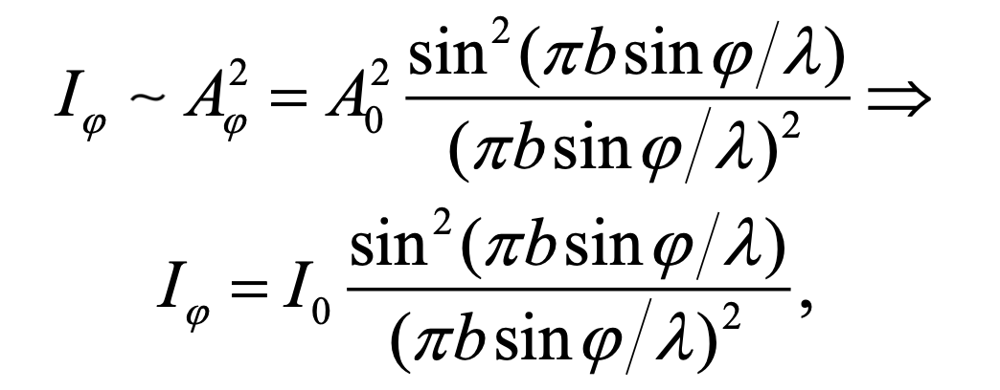
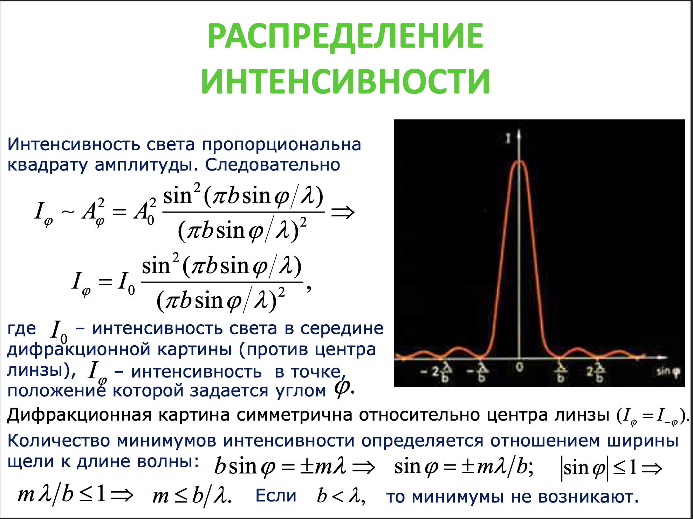

````
# Задаем параметры дифракционной решетки
period = 1.0  # период решетки
total_strokes = 1000  # общее число штрихов
````

````
period = 1.0

Эта часть кода задает период решетки.

Период решетки - это расстояние между соседними штрихами (или отверстиями) на дифракционной решетке.

Период дифракционной решетки, в данном случае равный 1.0, определяет расстояние между соседними штрихами (или отверстиями) на решетке.
Это важный параметр, который влияет на дифракционный паттерн, который вы видите при прохождении света через решетку.

В контексте дифракции света, период решетки влияет на углы, под которыми наблюдаются дифракционные максимумы (яркие полосы). 
Конкретно, углы дифракционных максимумов определяются формулой дифракции решетки:
````

<p align="center">
    
</p>

````
sin(фи): Это синус угла дифракции. Угол дифракции - это угол между направлением входящего света и направлением дифракционного максимума (яркой полосы).

m или в нашем случае k: Это порядок дифракционного максимума. Это целое число, которое определяет номер дифракционного максимума. Например, m = 0 соответствует центральному максимуму, m = 1 соответствует первому дифракционному максимуму по обе стороны от центрального максимума, и так далее.

lambda: Это длина волны света. Длина волны определяет цвет света. Например, короткие длины волн соответствуют синему цвету, а длинные длины волн соответствуют красному цвету.

d: Это период решетки, то есть расстояние между соседними штрихами (или отверстиями) на решетке.
````

````
total_strokes = 1000 

В этом коде total_strokes = 1000 задает общее число штрихов на дифракционной решетке. Штрихи - это отверстия или прорези на решетке, через которые проходит свет.

Число штрихов влияет на общую интенсивность дифракционного паттерна.
Большее число штрихов обычно приводит к более яркому и четкому дифракционному паттерну. Это связано с тем, что больше штрихов означает больше путей, по которым свет может проходить и интерферировать, создавая дифракционный паттерн.
````
---
````
theta = np.linspace(-np.pi / 2, np.pi / 2, 100)  # угол дифракции
wavelength = np.linspace(400, 750, 2000)  # длина волны в нм
````

````
theta = np.linspace(-np.pi / 2, np.pi / 2, 100)

В этой строке кода используется функция np.linspace из библиотеки NumPy для создания массива значений. Эта функция принимает три аргумента: начальное значение, конечное значение и количество значений.

-np.pi / 2: Это начальное значение диапазона. Здесь используется значение -np.pi / 2, что соответствует углу в -90 градусов. np.pi - это значение числа пи в библиотеке NumPy.
np.pi / 2: Это конечное значение диапазона. Здесь используется значение np.pi / 2, что соответствует углу в 90 градусов.

Почему такие углы? В данном случае углы дифракции (theta) варьируются от -pi/2 до pi/2, что соответствует диапазону от -90 до 90 градусов.
Это означает, что мы рассматриваем дифракцию света, происходящую в полукруге вокруг точки, где свет падает на решетку.
Это стандартный выбор для анализа дифракции, поскольку он покрывает все возможные направления, в которых может распространяться дифракционный свет.

100: Это количество значений в массиве. Функция np.linspace создаст 100 равномерно распределенных значений между -np.pi / 2 и np.pi / 2.
Таким образом, theta становится массивом из 100 значений, равномерно распределенных от -np.pi / 2 до np.pi / 2. Эти значения представляют углы дифракции, которые будут использоваться при расчете дифракционного паттерна.

Почему столько значений? Значение 100 в функции np.linspace определяет количество точек в диапазоне углов. Большее количество точек приводит к более детализированному и точному представлению дифракционного паттерна. Однако это также требует больше вычислительных ресурсов.


В контексте дифракции света, угол дифракции - это угол между направлением входящего света и направлением дифракционного максимума (яркой полосы). Этот массив будет использоваться для расчета углов, под которыми наблюдаются дифракционные максимумы.
````

````
wavelength = np.linspace(400, 750, 2000)

В этой строке кода wavelength = np.linspace(400, 750, 2000) создается массив значений длин волн света для моделирования дифракции.

np.linspace(400, 750, 2000): Это вызов функции linspace из библиотеки NumPy, которая генерирует равномерно распределенные числа в заданном интервале. В данном случае она генерирует 2000 чисел в диапазоне от 400 до 750.

400, 750: Это диапазон длин волн света в нанометрах, который мы хотим исследовать. Значение 400 нм обычно соответствует голубому цвету, а 750 нм - красному. Таким образом, этот диапазон покрывает почти все видимое спектральное пространство, которое может воспринимать человеческий глаз.
2000: Это количество точек, которые мы хотим сгенерировать в этом диапазоне. Большее количество точек приводит к более детальному и точному представлению дифракционного паттерна. Однако это также требует больше вычислительных ресурсов. Значение 2000 является разумным компромиссом между точностью и вычислительной эффективностью.

Таким образом, wavelength = np.linspace(400, 750, 2000) генерирует массив из 2000 длин волн света, равномерно распределенных от 400 до 750 нм. Эти значения затем используются при расчете дифракционного паттерна для каждой длины волны. 
````

<p align="center">
    
</p>

---
````
Theta, Wavelength = np.meshgrid(theta, wavelength)

В этой строке кода используется функция np.meshgrid из библиотеки NumPy. Эта функция принимает два одномерных массива и генерирует два двумерных массива. Эти двумерные массивы представляют собой все возможные комбинации значений из входных массивов.

theta, wavelength: Это входные массивы для функции np.meshgrid. Массив theta содержит значения углов дифракции, а массив wavelength содержит значения длин волн света.
Theta, Wavelength: Это выходные массивы из функции np.meshgrid. Массив Theta содержит значения углов дифракции, повторенные для каждой длины волны. Массив Wavelength содержит значения длин волн света, повторенные для каждого угла дифракции.

Таким образом, Theta и Wavelength являются двумерными массивами, которые содержат все возможные комбинации углов дифракции и длин волн. Эти массивы затем используются при расчете интенсивности дифракционного паттерна для каждой комбинации угла дифракции и длины волны.
````
---

````
Intensity = np.sin(np.pi * total_strokes * period * np.sin(Theta) / Wavelength) ** 2 / \
            (np.sin(np.pi * period * np.sin(Theta) / Wavelength) ** 2)
````

У нас тут I_0 = 1 для более простых вычислений, поскольку по условию это не входные данные, но при этом I_0 должна определяться экспериментально.

<p align="center">
    
</p>

<p align="center">
    
</p>

````
В данной формуле total_strokes представляет общее число штрихов на дифракционной решетке. Это число важно, потому что каждый штрих на решетке действует как источник вторичных волн, согласно принципу Гюйгенса. Когда свет падает на решетку, каждый штрих решетки генерирует волну. Эти волны затем интерферируют друг с другом, создавая дифракционный паттерн.

В формуле total_strokes умножается на np.sin(Theta) / Wavelength, что представляет собой разность фаз между волнами, исходящими от соседних штрихов. Затем берется синус этой величины, что соответствует принципу суперпозиции волн: волны складываются, когда они встречаются.

Таким образом, total_strokes влияет на общую интенсивность дифракционного паттерна. Большее число штрихов приводит к большей общей интенсивности, так как больше штрихов генерирует больше волн, которые могут интерферировать и создавать дифракционный паттерн. Это число можно изменить в зависимости от ваших потребностей или специфики эксперимента.
````
---
````
# Создаем цветовую карту, где цвета соответствуют длинам волн
colors = [(0.0, 'blue'), (0.5, 'green'), (0.8, 'yellow'), (1.0, 'red')]  # (длина волны, цвет)
cmap_wave = LinearSegmentedColormap.from_list('wave', colors)
````

````
В этой строке кода colors = [(0.0, 'blue'), (0.5, 'green'), (0.8, 'yellow'), (1.0, 'red')] создается список кортежей, которые используются для создания цветовой карты. Каждый кортеж состоит из двух элементов: числа от 0 до 1 и соответствующего цвета.

Числа в кортежах представляют собой относительные длины волн света, где 0 соответствует самой короткой длине волны (синий цвет), а 1 - самой длинной (красный цвет). Числа между 0 и 1 представляют промежуточные длины волн и соответствующие им цвета. Например, 0.5 соответствует зеленому цвету, который находится примерно посередине спектра видимого света.

(0.0, 'blue') - это кортеж, где 0.0 соответствует синему цвету, который обычно ассоциируется с короткими длинами волн света.
(0.5, 'green') - это кортеж, где 0.5 соответствует зеленому цвету, который обычно ассоциируется со средними длинами волн света.
(0.8, 'yellow') - это кортеж, где 0.8 соответствует желтому цвету, который обычно ассоциируется с длинами волн света, близкими к красному.
(1.0, 'red') - это кортеж, где 1.0 соответствует красному цвету, который обычно ассоциируется с самыми длинными длинами волн света.
Эти числа и цвета используются для создания цветовой карты, которая затем используется для визуализации данных. В данном случае, эта цветовая карта используется для отображения интенсивности света в зависимости от угла дифракции и длины волны. Это позволяет визуально отобразить, как различные длины волн света распределяются по углу дифракции.

````

````
cmap_wave = LinearSegmentedColormap.from_list('wave', colors)
Код, созданный ИИ. Внимательно просмотрите и используйте. Дополнительные сведения о часто задаваемых вопросах.
LinearSegmentedColormap.from_list('wave', colors) - это функция из библиотеки matplotlib, которая создает цветовую карту из списка цветов.

'wave' - это имя, которое вы хотите дать своей цветовой карте. В данном случае, оно названо ‘wave’.
colors - это список кортежей, которые вы определили ранее. Каждый кортеж состоит из двух элементов: числа от 0 до 1 и соответствующего цвета. Эти числа представляют собой относительные длины волн света, где 0 соответствует самой короткой длине волны (синий цвет), а 1 - самой длинной (красный цвет).
Результатом выполнения этой строки кода будет цветовая карта cmap_wave, которую можно затем использовать для визуализации данных. В данном случае, эта цветовая карта используется для отображения интенсивности света в зависимости от угла дифракции и длины волны. Это позволяет визуально отобразить, как различные длины волн света распределяются по углу дифракции.
````


---
